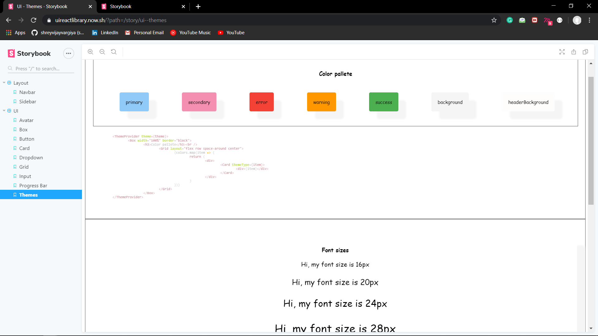
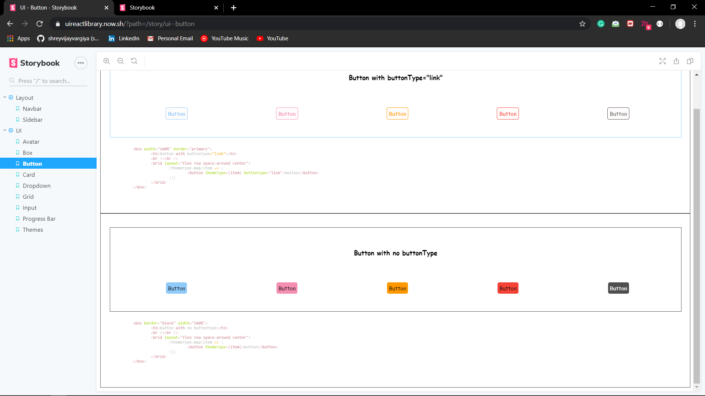
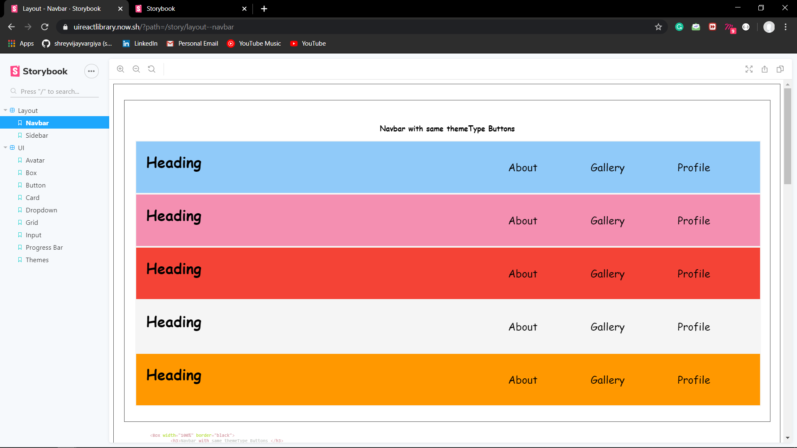

<h1>React UI Library </h1>

<h2>How to use ?</h2>
<ol>
	<li>Clone the repository</li>
	<li>Run yarn install</li>
	<li>Run yarn run dev</li>
</ol>

<h2>Tech Stack used</h2>
<ol>
	<li>React JS</li>
	<li>Storybook(For Demo )</li>
	<li>Babel</li>
</ol>

<h2>Demo</h2>
<h4> Themes <h4>

Theme color and sizes are extensible to users requirements

<h3>Components<h3>

<h4>Buttons</h4>

<h3>Navbar<h4>

<h2>How To contirbute ?</h2>
<ol>
	<li>Raise the issue</li>
	<li>Clone the repo, create branch and after completing create PR for you branch
</ol>

<h2>Upcoming Features</h2>
<ol>
	<li>Addition of More components </li>
	<li>Highly Extensible <strong>THEME</strong> Property/Object</li>
	<li>Reduce the bundle size</li>
	<li>Well Documentation of each components and its API or props</li>
	<li>Deployed the package as npm package[Open Source the ui library]</li>
</ol>
